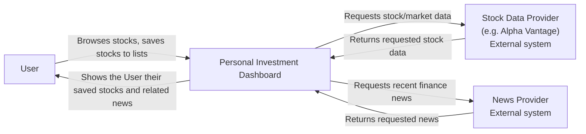

# Lab 1: Personal Investment Dashboard

## 1. Product research

**Research question:** How do existing products help a User follow market information, and which parts belong in this Dashboard's first version?

| Product | Likely User and goal | Reusable pattern |
| ------- | --------------------- | ----------------- |
| Google Finance / Yahoo Finance | A casual investor who wants to quickly check and track a set of stocks/companies without deep analysis — a "viewing experience" first | Pin/watch individual stocks; sort by country; trending page with top gainers/losers/most active; integrated news feed; ability to build multiple named lists; simple enough for a newcomer to use immediately |
| TradingView | A more experienced or intentional trader who wants advanced charting, technical analysis, and even automated strategy/bot setups | Deep charting and analysis tools; power-user configurability — noted as *out of scope for v1*, but a signal for later product direction |

Two existing products were examined to see how the market already interprets a vague request like "help me follow my investments": Google Finance and Yahoo Finance, which center a simple viewing experience, and TradingView, which centers advanced charting and analysis. This comparison surfaced a clear split between simplicity and analytical depth, which directly shaped the v1 scope decisions in Section 3.

A related idea surfaced during research: a long-term vision for the product that would progressively unlock more advanced viewing and analysis, and eventually trading. That vision is deliberately left out of this document, since this lab asks for a v1 product description rather than a roadmap — it is recorded here only so the reasoning behind later decisions isn't lost.

Google Finance's "Ask AI" feature was also noted during research. It was deliberately deferred rather than overlooked, and appears explicitly as a non-goal in Section 3.

---

## 2. Stakeholders and actors

Three human candidates were initially considered for the primary actor role: a general investor tracking stocks already held, a market analyst monitoring the market more broadly, and a casual, less experienced user. Rather than modeling all three separately, each was evaluated against how differently it would actually need to interact with a viewing-only dashboard.

Since the v1 goals (Section 3) describe a single, simple viewing experience, and advanced analysis is explicitly excluded as a non-goal, the three candidates were merged into one actor for v1: **User**. The distinction between them is preserved as a note, since it is expected to matter once advanced viewing/analysis moves into scope:
- *Investor/Casual User* — the simple-viewing persona; this is the entirety of the v1 User.
- *Analyst* — a persona expecting deeper, TradingView-style analysis; deferred to a later version alongside the analysis non-goal it depends on.

| Stakeholder | Motivation | Influence | Reason |
| ----------- | ---------- | --------- | ------ |
| User (investor / casual investor, merged for v1) | High | Low | Directly relies on the dashboard to track how their stocks are performing, but no individual user can change a product decision |
| Market/stock data provider (e.g. Alpha Vantage — also acts as data licensor) | Low | High | Doesn't care about this app specifically, but the dashboard's core data depends entirely on it |
| News feed provider | Low | High | A separate external data source the news-feed goal depends on |
| Governments / banks / regulators | Low | High | Not engaged day-to-day, but can impose rules (e.g. financial-data compliance) that constrain the product |
| App store (Google Play / App Store) | Low | High | Doesn't care about this specific app, but controls distribution and can block or require changes |
| Product team (PO, PM, devs) | High | High | Directly makes and owns every product decision |

**Motivation / influence matrix**

| Motivation | Low influence | High influence |
| ---------- | -------------- | ---------------- |
| High | User | Product team |
| Low | — | Data provider, News feed provider, Regulators, App store |

**Classification**

| Candidate | Stakeholder? | Direct actor? | Reason |
| --------- | ------------ | -------------- | ------ |
| User | Yes | Yes | Opens the app, views/tracks stocks — direct interaction |
| Market/stock data provider | Yes | Yes (external system) | The Dashboard calls it directly for price/quote data |
| News feed provider | Yes | Yes (external system) | The Dashboard calls it directly for news content |
| Governments/banks/regulators | Yes | No | Can impose limits but never touches the running system |
| App store | Yes | No | Controls distribution, not a runtime dependency |
| Product team | Yes | No | Makes decisions but is not in the User's journey |

Stock exchanges (NYSE, NASDAQ, etc.) are the true origin of market data, but the Dashboard never talks to them directly — the data provider sits in between. Exchanges are therefore real but indirect, and are left out of the System Context view for that reason.

---

## 3. Product promise and scope

**Product promise:**

> **Personal Investment Dashboard** helps **Users** solve **the fragmented and difficult-to-follow market information of the stocks they invested in** so that **they can track all the relevant information in one place**.

### Goals

- Let a User sort stocks by region or country.
- Let a User organize stocks they care about into one or more named lists.
- Show a User the current trending stocks and top gainers/losers.
- Show a User the latest finance news headlines.
- Let a User compare multiple stocks on the same graph.
- Let a User view a stock's performance over selectable time periods (1D, 1W, 1M, 6M, 1Y, 5Y).
- Let a User search for a stock by company name, ticker, or index.

### Non-goals

- The news feed is not personalized per User for v1 (no filtering to only pinned stocks).
- The product does not support buying, selling, or otherwise trading stocks.
- No technical-analysis tools — indicators, overlays, drawing tools — only price/performance graphs.
- No AI-assisted Q&A features about stocks.

### Constraints and assumptions

| Type | Personal Investment Dashboard example |
| ---- | -------------------------------------- |
| Constraint | V1 supports viewing and tracking only — it does not execute trades |
| Constraint | Only instruments covered by the chosen data provider can be shown |
| Constraint | V1 is a single-user personal tool — no shared or team accounts |
| Assumption | The data provider returns data timely and accurate enough for casual tracking, not trading-grade tick data |
| Assumption | The news provider's general finance headlines are relevant enough without per-user personalization |
| Assumption | A single merged "User" persona is sufficient for v1 — investor, casual, and analyst needs don't diverge enough yet to require separate actors |
| Assumption | The chosen data and news providers offer a free or low-cost tier sufficient for a personal-scale project |

---

## 4. Functional requirements (user stories)

Organized by epic, per the lecture's epic → actor goal → user story → definition-of-done method.

### Epic 1: Finding, organizing, and saving stocks to watch

**Story 1 — Search**

Actor goal: The User needs to find a specific stock quickly instead of scrolling through everything.

> As a User, I want to search for a stock by company name, ticker, or index, so that I can quickly get to the one I'm looking for.

Definitions of done:
- Show matching stocks when the search term matches a company name, ticker, or index.
- If no stock matches, show that clearly instead of an empty screen.
- If the data provider is unavailable, show that search results can't be loaded right now — don't show an empty or false "no results."

**Story 2 — Sort by region**

Actor goal: The User should be able to sort stocks by region.

> As a User, I want to see only stocks from a region I select, so that I can focus on the market I care about.

Definitions of done:
- Show the correct stocks for the selected region.
- If a region has no stocks, show that clearly instead of an empty screen.
- If the data provider is unavailable, show that stocks can't be loaded right now.

**Story 3 — Organize stocks into named lists**

Actor goal: The User should be able to organize stocks into one or more named lists.

> As a User, I want to save and organize the stocks I care about into named lists, so that I can find and monitor them without searching for them again each time.

Definitions of done:
- The User can add a stock to one or more named lists and see which lists a stock belongs to.
- If a list is empty, show that clearly rather than leaving the User guessing.
- If list data can't be fetched, show a clear error instead of an empty list.

### Epic 2: Seeing what's happening on the market broadly

**Story 1 — Trending / gainers / losers**

Actor goal: The User needs to see what's currently notable in the market (top movers, most active stocks).

> As a User, I want to see the current top gainers, losers, and most-active stocks, so that I can spot anything unusual happening in the market.

Definitions of done:
- Show the current top gainers, losers, and most-active stocks.
- If there's no notable activity, show that clearly instead of an empty list.
- If the shown data is out of date, indicate it's stale rather than presenting it as current.
- If the data can't be fetched at all, show a clear error — never an empty list.

**Story 2 — News headlines**

Actor goal: The User needs to see the latest finance/market news.

> As a User, I want to see the latest finance news headlines, so that I can stay informed about events that might affect my stocks.

Definitions of done:
- Show the latest headlines from the news provider.
- If there's nothing new, tell the User clearly instead of showing an empty feed.
- If the headlines are out of date, indicate they're stale rather than presenting them as current.
- If the news provider can't be reached, show a clear error — never an empty feed.

### Epic 3: Analyzing stocks over time

**Story 1 — Time-period view**

Actor goal: The User needs to see a specific stock's performance over selectable time periods.

> As a User, I want to view a specific stock's performance over selectable time periods, so that I can track gains/losses and plan future decisions.

Definitions of done:
- Show the full graph for the selected time period.
- If the whole graph can't be loaded, tell the User clearly — don't show an empty page.
- If only part of the period can't be loaded, show the parts that are available and mark the missing portion clearly.

**Story 2 — Multi-stock comparison**

Actor goal: The User should be able to see and compare multiple stocks on one graph.

> As a User, I want to monitor multiple stocks together on one graph, so that I can compare their performance side by side.

Definitions of done:
- Show all selected stocks together on one graph.
- If one stock's data has a gap, mark that portion so the User knows it isn't real data.
- If one stock's data fails entirely, tell the User that stock couldn't be shown, while still showing the others.
- If all the data fails, tell the User clearly — don't show an empty page.

---

## 5. C4 System Context

Read from the outside:
1. Personal Investment Dashboard is the system of interest.
2. User is the one human actor (v1 merges investor/casual/analyst personas — see Section 2 note).
3. Stock Data Provider and News Provider are external systems the Dashboard directly depends on.
4. Stock exchanges are a real upstream source but are *not* shown — the Dashboard never talks to them directly (see Section 2 note).

---

## Checklist (from the lab)
- [x] Researched at least two existing products
- [x] Cited evidence for each selected product pattern
- [x] Research changed or confirmed at least one scope decision
- [x] Stakeholder motivation/influence mapped
- [x] Stakeholders, direct actors, external systems separated
- [x] Product promise is one clear sentence
- [x] Goals and non-goals agree with the promise
- [x] At least five user stories
- [x] Every story has 2–4 definitions of done
- [x] At least two stories include an important alternative result
- [x] External dependencies include a User-visible missing/stale/unsupported result
- [x] C4 System Context view created
