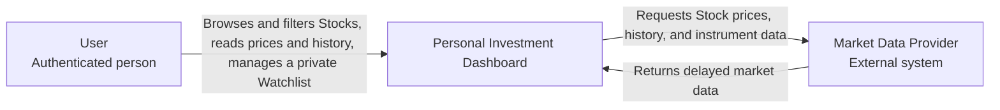
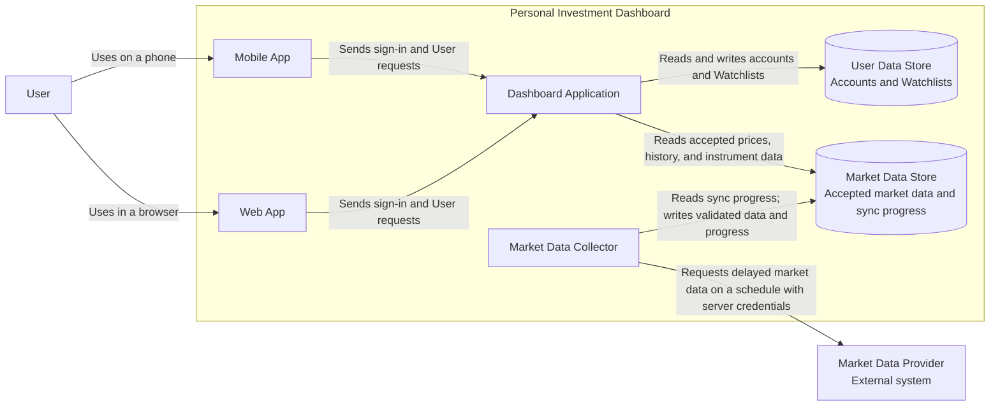
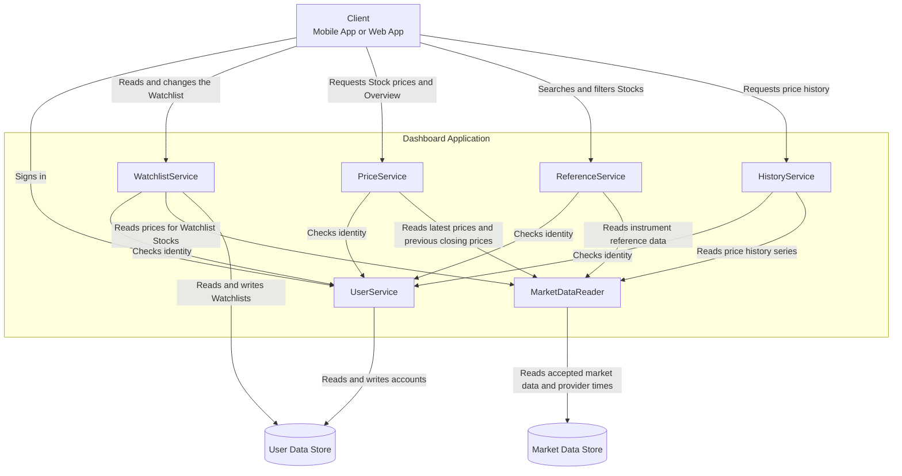
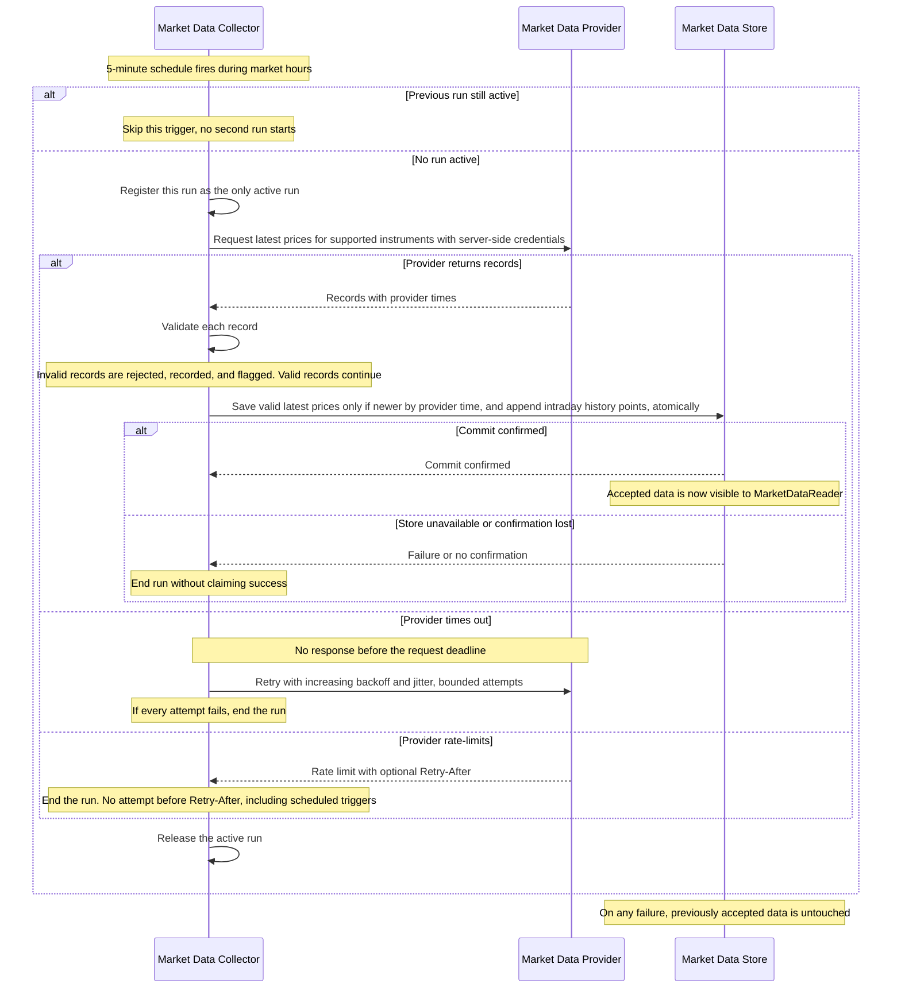
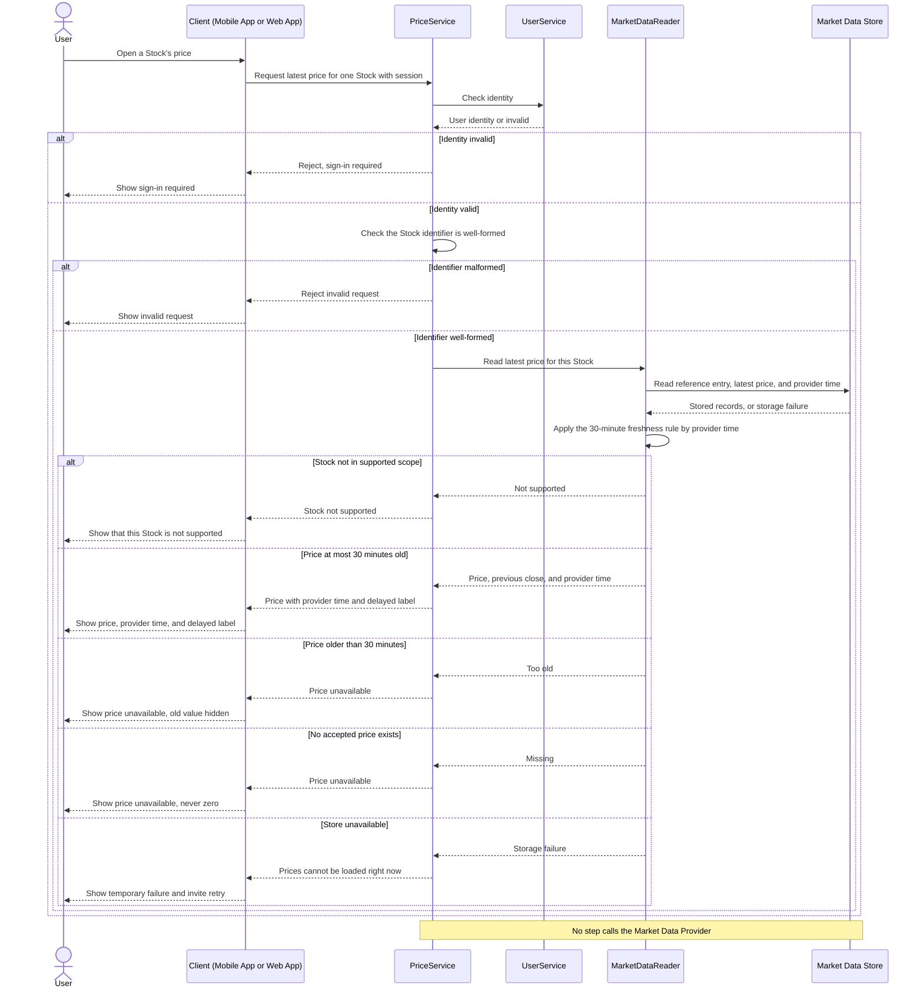
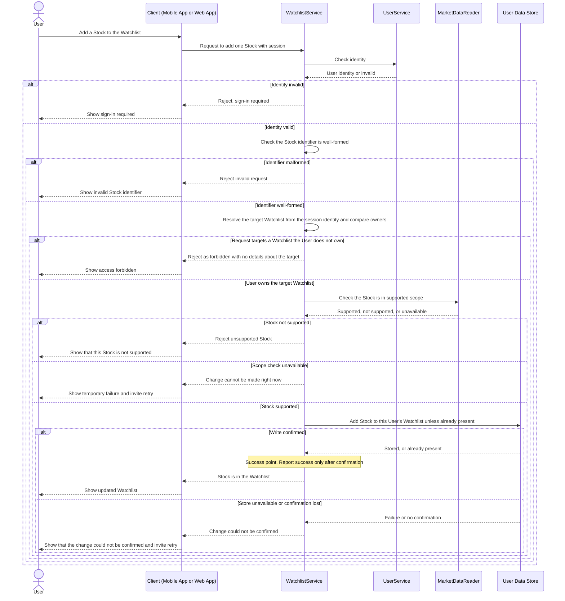

# Lab 3: Draw the Dashboard Boundary — Working Draft

> Working order: Context → Container → Component → Sequences A, B, C. The sequences test the structure; if one exposes a gap, the Container or Component view gets revised.

## Inputs carried forward from Lab 2

| Input | Value |
| ----- | ----- |
| Direct human actor | Authenticated User |
| External system | Market Data Provider (delayed data; can return invalid data, rate limits, or outages) |
| Design point | 3,000 concurrent Users — 792 RPS steady, 1,030 RPS market-open target |
| Heaviest read path | Stock price — 600 RPS, ~76% of steady traffic, p95 ≤ 1 s |
| Freshness rule | Price shown with provider time and delayed label up to 30 min old; unavailable beyond 30 min or if never received; never zero |
| Sync assumption | Current prices every 5 min during market hours; history daily after close; metadata daily |
| Watchlist rule | Only the owner may read or change it; next read after a confirmed change shows the update; forbidden ≠ empty ≠ fetch failure |
| Scope | Xetra only, 4,106 instruments (shares + ETFs), ≈248 MiB retained market data |

---

## 1. System Context

The User is the only direct human actor, and the Market Data Provider is the only external system. The news provider from the original Lab 1 submission was removed in the Lab 1 review and does not appear.

**Authentication decision: in-house.** Sign-in is handled inside the Dashboard, so no identity provider appears in this view. An external identity provider ("Sign in with Google") was considered. It would remove password storage and provide account recovery and multi-factor authentication. It was rejected because it adds a second external dependency on the sign-in path: an outage there would stop Users from reaching their Watchlist and would consume the market-hours downtime budget from Lab 2. External sign-in would also not remove the Dashboard's data-protection obligations, since the Watchlist is personal data the Dashboard holds either way. Authorization stays inside the Dashboard regardless of where identity is checked.

Provider failure modes (invalid data, rate limits, outages) are not shown here. They are internal handling concerns and appear in the Container view and in sequence A.

---

## 2. Container view

| Container | Responsibility |
| --------- | -------------- |
| Mobile App | Provides the User's mobile interface |
| Web App | Provides the User's browser interface |
| Dashboard Application | Serves all User requests: sign-in, access checks, market data reads, and Watchlist changes |
| Market Data Collector | Keeps accepted market data current by syncing from the provider on a schedule |
| User Data Store | Retains User accounts and Watchlists |
| Market Data Store | Retains accepted instrument data, latest prices, history, and sync progress |

### Design decisions

**Two client apps.** A Mobile App and a Web App, matching the two product patterns from the Lab 1 research (Google Finance on mobile, Yahoo Finance in the browser). This keeps the App Store stakeholder from Lab 1 relevant.

**No API Gateway.** Both clients call the Dashboard Application directly. With a single backend application, a gateway would route every request to the same place, adding a hop and a failure point to the Stock price path, which carries a p95 ≤ 1 s target.

**Market Data Collector as a separate container.** This is justified by specific differences, not by a general preference for more services:
- it is triggered by a schedule, not by User requests;
- it holds the provider credentials, which stay out of the application that serves Users;
- rate limits and deduplicated sync work require one active process controlling provider traffic;
- provider slowness, rate limits, and outages stay off the User request path.

**Sign-in stays inside the Dashboard Application.** Sign-in and profile changes are low-volume and carry no pressure that justifies a separate container. Accepted risk: if the Dashboard Application is down, Users cannot sign in. In that case prices are also unreachable, so a separate sign-in service would not restore a usable product.

**Two stores, one writer each.** Market data and User data have different owners and write patterns: batch writes from scheduled sync versus individual User changes. Separating them gives each store a single writer.
- The **Collector is the only writer** of the Market Data Store.
- The **Dashboard Application reads it directly** and never writes it.
- The **Dashboard Application is the only reader and writer** of the User Data Store.

A separate read replica for market data was considered and rejected: frequent sync writes would keep the copy constantly catching up, adding overhead without a measured need.

**Background-only sync; User reads never call the provider.** The Collector syncs current prices every 5 minutes (Lab 2), so a User read is served entirely from accepted stored data.
- Benefit: the 600 RPS price path never waits on provider latency, quota, or failure.
- Benefit: if the Collector stops, Users still see accepted prices with their delayed label until they pass the 30-minute limit. After that they see unavailable, never a false current price.
- Accepted cost: data that has never been synced cannot be fetched on demand. It shows unavailable until the next scheduled run.

Note on diagnosis: the 30-minute rule protects the User from a false price, but stale data alone does not identify the cause. A provider outage, a rate limit, and a stopped Collector all produce the same symptom. Diagnosing them needs the Collector's own signals, such as last attempt versus last successful sync.

**Deliberately not added:** a cache. The Lab 2 bottleneck analysis flagged repeated price reads as a hypothesis to measure, not a proven limit. A cache is deferred until per-path latency measurements show the store cannot meet the target.

---

## 3. Component view — Dashboard Application

`Client` groups the Mobile App and Web App for this view, following the lecture's convention; it is not a new container. All six components are parts of the one Dashboard Application, so calls between them are in-process, with no network hop.

| Component | Responsibility |
| --------- | -------------- |
| UserService | Handles User accounts, sign-in, and identity checks |
| WatchlistService | Handles each User's private Watchlist and checks that the requesting User owns it |
| PriceService | Returns latest Stock prices and the Overview (top gainers, losers, most active) |
| ReferenceService | Returns instrument reference data for Search and Filter |
| HistoryService | Returns price history series for the 1D–5Y charts |
| MarketDataReader | The only component that reads the Market Data Store; applies the 30-minute freshness rule to every result that includes a price |

### Design decisions

**Grouping by data, not by screen.** The components follow the data each read touches:
- Search and Filter both query instrument reference data, so they share **ReferenceService**.
- Stock price and Overview both work with latest prices (Overview ranks by change from previous close), so they share **PriceService**.
- History works with a time series of a different shape, so it has its own **HistoryService**.

PriceService carries ~600 of 792 steady RPS (Lab 2) under the strictest target. It is the first component to measure.

**Identity and permission are checked in different places.** Every request-receiving component asks UserService *who* sent the request, since all reads require an authenticated User. **Permission** is checked only where protected data lives: WatchlistService verifies that the requesting User owns the Watchlist before reading or changing it. Market data is not per-User, so it needs identity only.

**One reader and one freshness rule for market data.** MarketDataReader is the single access point to the Market Data Store. The delayed label and the unavailable result are therefore applied identically wherever a price appears: Stock price, Overview, and Watchlist. If each component applied the rule itself, the copies could drift apart. The rule applies only to prices; reference data such as names and sectors has no 30-minute limit.

**No entry component.** Each component that receives a request performs its own identity check through UserService. This replaces a gateway's role without adding a routing layer.

**The Collector does not appear here.** No Dashboard Application component communicates with the Market Data Collector directly. The two meet only through the Market Data Store, which the Collector writes and MarketDataReader reads.

Future note: ReferenceService could grow into a more powerful search foundation that Filter and Overview build on. This is not needed for v1.

---

## 4. Sequence diagrams

### A. Sync market data

**Starting assumptions**
- Users never trigger sync; only the 5-minute schedule does (Section 2).
- One Collector process runs at a time, so "only active run" is tracked inside that process. Multiple Collector processes would need shared coordination.
- This diagram shows the 5-minute latest-price sync. The daily history sync after close and the daily metadata sync (tickers, names, sectors, newly listed instruments) follow the same pattern on their own schedules.

**Validation rules** (checked per record): supported instrument, required fields present, numeric and non-negative price, provider timestamp within the agreed clock tolerance. A missing price is rejected, never stored as zero.

**Write rules** (enforced as part of the store write, separate from validation):
- A latest price is replaced only if the incoming provider time is newer. An older valid observation is not an error; it is simply not applied.
- Each intraday history point has a stable identity (instrument, interval, provider time), so a repeated write cannot create a duplicate. This makes retrying an unconfirmed write safe.
- Age is always judged by **provider time**, never fetch time. Fetching an old price again must not make it look recent.

**Per-record rather than whole-batch rejection.** One latest-price batch covers all 4,106 instruments. Rejecting the whole batch for one bad record would leave every price un-updated, and within 30 minutes the entire Dashboard would show unavailable. Rejecting only the bad record keeps the rest current.

**Failure handling differs by cause**

| Failure | Response | Why |
| ------- | -------- | --- |
| Invalid record | Reject, record, flag for investigation. No retry | Asking again will likely return the same bad data |
| Timeout | Retry with increasing backoff, jitter, and a bounded attempt count | A retry can genuinely succeed |
| Rate limit | End the run and wait until Retry-After. Scheduled triggers may not bypass it | Retrying sooner consumes quota and delays recovery |
| Store failure | End the run without claiming success | Newer-only and stable-identity rules make the later retry safe |

**What happens to previously accepted data when sync fails:** nothing. Failed work writes nothing, so earlier accepted prices remain readable. MarketDataReader shows them with their provider time and delayed label until they pass 30 minutes, then unavailable. The next scheduled run tries again.

### B. Read a Stock price

**Starting assumptions**
- The User has an existing session from an earlier sign-in.
- The Market Data Collector has been syncing on schedule. This read does not depend on whether the latest run succeeded; it only reads what was accepted.
- Lab 2 latency cutoff applies: if the Client receives no result within 2 s, it shows the price as unavailable rather than leaving it loading.

**Does a User read need a new provider request? No.** Every price read is served from accepted stored data. User traffic never consumes provider quota and never waits on provider latency or failures. A price that has not been synced yet is unavailable until the next scheduled run (Section 2).

**Five distinct results.** Each needs a different User response, so none may be merged.

| Result | Meaning | What the User should do |
| ------ | ------- | ----------------------- |
| Price with delayed label | Normal operation; data is ~15 min behind by nature | Read it |
| Not supported | Outside the Xetra shares-and-ETFs scope | Asking again will not help |
| Unavailable: too old | Accepted price passed 30 minutes, so it is hidden | Check later |
| Unavailable: missing | No accepted price has ever been stored | Check later; never shown as zero |
| Cannot be loaded right now | Temporary storage fault, not a fact about the Stock | Retry |

The last row is kept separate from "missing" on purpose. Treating a storage failure as a missing record would tell the User the Stock has no data, when in fact the system briefly could not read it.

### C. Change a private Watchlist

**Starting assumptions**
- Each User has exactly one Watchlist (per the Lab 1 review).
- The User has an existing session from an earlier sign-in.

**Which Watchlist is changed is decided by the server, not the Client.** The target Watchlist is resolved from the session identity, never from an identifier the Client supplies. The Client's normal buttons can only ever reach the User's own Watchlist. The forbidden branch covers a crafted request that tries to name another owner. Permission is checked on every request and denied by default.

**Check order: identity → input → permission → scope → write.** Permission comes before the scope check, so a forbidden request learns nothing about the system's data, not even whether a Stock is supported.

**Forbidden is uniform and reveals nothing.** Returning an empty list to confuse an attacker was considered and rejected. For a write, it would be a false success: the attacker's change would appear to work. It would also break Rule B from Lab 2 (forbidden ≠ empty ≠ fetch failure) and hide real permission bugs behind a silently empty Watchlist. A uniform forbidden response, with no detail about whether the target exists, gives the same protection honestly.

**Adding a Stock that is already present is a success with no change.** No duplicate is created, and the User sees the Stock in their Watchlist. This makes a retry safe: if a confirmation was lost and the User taps "add" again, they get the correct result, not an error for a change that actually succeeded. It also covers the same User adding the same Stock from the Mobile App and the Web App at once. The "unless already present" check is part of the write itself, so two simultaneous adds cannot both insert.

**Success point:** only after the User Data Store confirms the write. A failed write and a write whose confirmation was lost both report "could not be confirmed." The retry is safe because of the rule above.

**The same User's next Watchlist read** must show the previous contents plus the added Stock. Prices shown in the Watchlist pass through MarketDataReader and follow the same 30-minute freshness rule as Sequence B.

---

## Checklist

- [x] One System Context, one Container, and one Component diagram
- [x] The three required sequence diagrams
- [x] All six Mermaid blocks render without an error (verified with Mermaid CLI 11.12)
- [x] The Component diagram opens only the Dashboard Application
- [x] Flows show normal results, rejected actions, and failure results
- [x] Design covers normal reads, private data, provider ingestion, and failures
